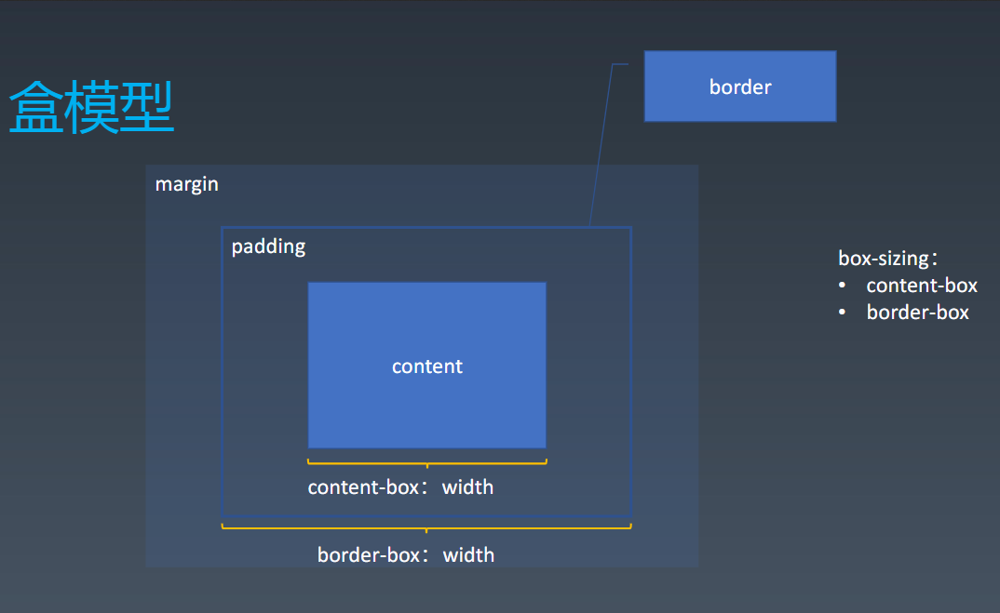
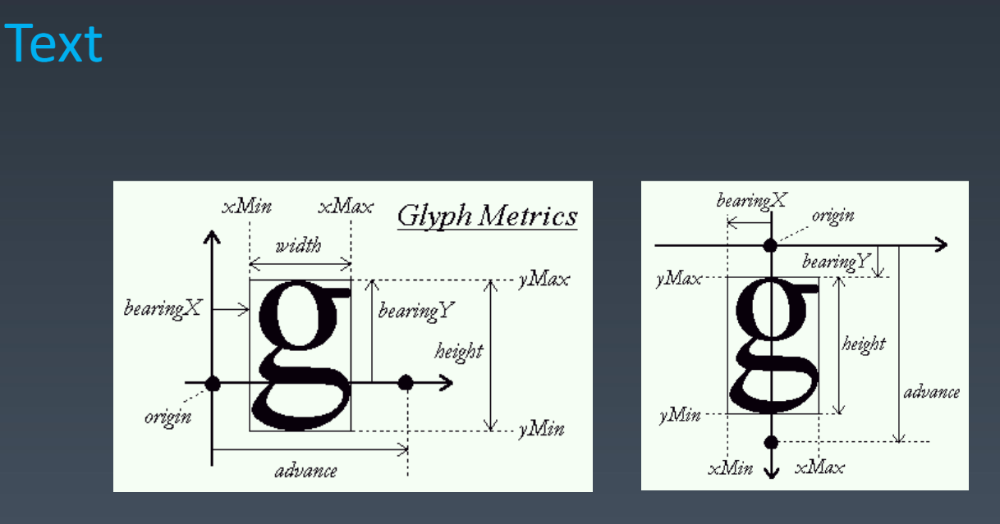
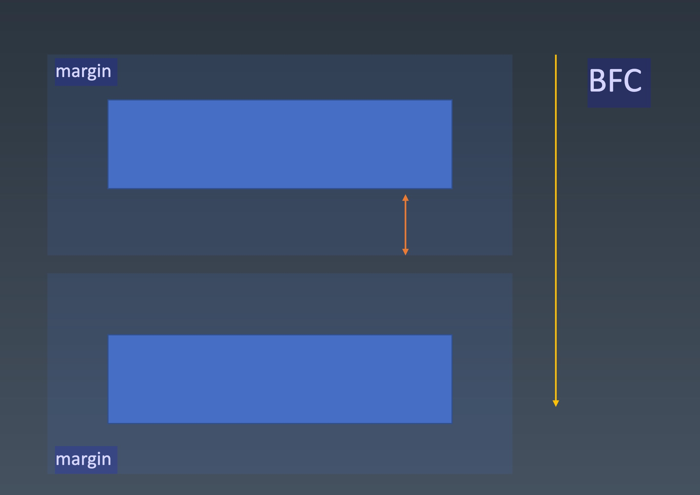

# 学习笔记
## 盒（box）
标签（tag） -- 源代码
元素（element） -- 语义
盒（box）-- 表现
HTML代码中可以书写开始 标签（tag），结束 标签，和只封闭 标签。<br/>
一对起止 标签， 表示一个 元素（element）。<br/>
DOM树中存储的是 元素 和其他类型的节点（node）。<br/>
>DOM树中存储的不全是元素，元素是节点的一种，还有文本节点，注释节点，CDATA，DTD等

css选择器选中的是 元素 或 伪元素。<br/>
css选择器选中的 元素，在排版时可能产生多个 盒。<br/>
排版和渲染的基本单位是 盒。<br/>
## 盒模型

box-sizing:
* content-box
* border-box

## 正常流

>css排版只排盒和文字
* 收集盒进行
* 计算盒在行中的排布
* 计算行的排布

IFC：inline-levle-formatting-context，行内级格式化上下文<br/>
BFC：block-levle-formatting-context，块级格式化上下文

### 正常流的行级排布
#### 基线对齐

任何一个文字都有宽和高，基线定义
orgin：文字的基线位置
bearingX：决定默认字间距
advance：字符占据的空间

#### 行模型

* base-line: 用来对齐的线。
* text-top, text-bottom: 字体大小不变这两者不会改变，由fontsize最大的一个字体决定
* 文字行高大于文字，会有line-top和line-bottom 两条线

### 正常流的块级排布
#### float与clear
计算位置的时候还没有去计算每一个文字具体的位置，float影响的文字不需要重排，把行盒的宽度根据float占据的宽度来进行调整，
float会影响我们生成的行盒尺寸。当float元素出现后，不止影响自己所在的这一行，凡是高度所占据的范围内，所有的行盒都会根据float元素的尺寸调整大小，超出float的范围就不考虑。
如果有两个float元素，float元素能浮动到的位置也会受上一个float元素的影响。
```
float:<div style="float:right;width:100px;height:100px;background-color:blue;"></div>
文字 文字 文字 文字 文字 文字 文字 文字 文字 文字 文字 文字 文字 文字 文字 文字 文字 文字 文字 文字 
文字 文字 文字 文字 文字 文字 文字 文字 文字 文字 文字 文字 文字 文字 文字 文字 文字 文字 文字 文字 
文字 文字 文字 文字 文字 文字 文字 文字 文字 文字 文字 文字 文字 文字 文字 文字 文字 文字 文字 文字 
文字 文字 文字 文字 文字 文字 文字 文字 文字 文字 文字 文字 文字 文字 文字 文字 文字 文字 文字 文字 
文字 文字 文字 文字 文字 文字 文字 文字 文字 文字 文字 文字 文字 文字 文字 文字 文字 文字 文字 文字 
float:<div style="float:right;width:100px;height:100px;background-color:blue;"></div>
文字 文字 文字 文字 文字 文字 文字 文字 文字 文字 文字 文字 文字 文字 文字 文字 文字 文字 文字 文字 
文字 文字 文字 文字 文字 文字 文字 文字 文字 文字 文字 文字 文字 文字 文字 文字 文字 文字 文字 文字 
文字 文字 文字 文字 文字 文字 文字 文字 文字 文字 文字 文字 文字 文字 文字 文字 文字 文字 文字 文字 
文字 文字 文字 文字 文字 文字 文字 文字 文字 文字 文字 文字 文字 文字 文字 文字 文字 文字 文字 文字 
文字 文字 文字 文字 文字 文字 文字 文字 文字 文字 文字 文字 文字 文字 文字 文字 文字 文字 文字 文字 
float:<div style="clear:right;float:right;width:100px;height:100px;background-color:blue;"></div>
文字 文字 文字 文字 文字 文字 文字 文字 文字 文字 文字 文字 文字 文字 文字 文字 文字 文字 文字 文字 
文字 文字 文字 文字 文字 文字 文字 文字 文字 文字 文字 文字 文字 文字 文字 文字 文字 文字 文字 文字 
文字 文字 文字 文字 文字 文字 文字 文字 文字 文字 文字 文字 文字 文字 文字 文字 文字 文字 文字 文字 
文字 文字 文字 文字 文字 文字 文字 文字 文字 文字 文字 文字 文字 文字 文字 文字 文字 文字 文字 文字 
文字 文字 文字 文字 文字 文字 文字 文字 文字 文字 文字 文字 文字 文字 文字 文字 文字 文字 文字 文字 
float:<div style="float:right;width:100px;height:100px;background-color:blue;"></div>
文字 文字 文字 文字 文字 文字 文字 文字 文字 文字 文字 文字 文字 文字 文字 文字 文字 文字 文字 文字 
文字 文字 文字 文字 文字 文字 文字 文字 文字 文字 文字 文字 文字 文字 文字 文字 文字 文字 文字 文字 
文字 文字 文字 文字 文字 文字 文字 文字 文字 文字 文字 文字 文字 文字 文字 文字 文字 文字 文字 文字 
文字 文字 文字 文字 文字 文字 文字 文字 文字 文字 文字 文字 文字 文字 文字 文字 文字 文字 文字 文字 
文字 文字 文字 文字 文字 文字 文字 文字 文字 文字 文字 文字 文字 文字 文字 文字 文字 文字 文字 文字 
float:<div style="float:right;width:100px;height:100px;background-color:blue;"></div>
文字 文字 文字 文字 文字 文字 文字 文字 文字 文字 文字 文字 文字 文字 文字 文字 文字 文字 文字 文字 
文字 文字 文字 文字 文字 文字 文字 文字 文字 文字 文字 文字 文字 文字 文字 文字 文字 文字 文字 文字 
文字 文字 文字 文字 文字 文字 文字 文字 文字 文字 文字 文字 文字 文字 文字 文字 文字 文字 文字 文字 
文字 文字 文字 文字 文字 文字 文字 文字 文字 文字 文字 文字 文字 文字 文字 文字 文字 文字 文字 文字 
文字 文字 文字 文字 文字 文字 文字 文字 文字 文字 文字 文字 文字 文字 文字 文字 文字 文字 文字 文字 
```

clear: 找一个干净的空间来执行浮动。

#### margin 折叠

折叠的高度跟最大的margin高度相等，margin只是要求盒周围所留的空白，而不是跟别的盒的边距。只会发生在BFC里

### BFC合并

#### Block
* Block Container: 里面有BFC的
    * 能容纳正常流的盒，里面就有BFC
        * block
        * inline-block
        * table-cell
        * flex item
        * grid cell
        * table-caption
* Block-level Box: 外面有BFC的
    * block level
        * display: block
        * display: flex
        * display: table
        * display: grid
    * inline level
        * display: inline-block
        * display: inline-flex
        * display: inline-table
        * display: inline-grid
* Block Box = Block Container + Block-level Box: 里外都有BFC的

#### 设立BFC
* float（浮动）
* absoluty positioned elements 绝对定位的元素
* block container （ such as inline-blocks, table-cells, and table-captions ); that ere not block boxes( flex item, grid cell )
* and block boxes with 'overflow' other than 'visible'

#### BFC合并
默认能容纳正常流的盒，都认为会创建BFC，但是下面的情况除外
* block box && overflow: visible
    * BFC合并与float
    * BFC合并与边距折叠

```
<body style="height: 500px;background-color: greenyellow;">
  <div style="float: right;width: 100px;height: 100px;background-color: aqua;margin: 20px;"></div>

  <div style="background-color: pink;overflow: visible;margin: 30px;">
  文字 文字 文字 文字 文字 文字 文字 文字 文字 文字 文字 文字 文字 文字 文字 文字 文字 文字 文字 文字 
  文字 文字 文字 文字 文字 文字 文字 文字 文字 文字 文字 文字 文字 文字 文字 文字 文字 文字 文字 文字 
  文字 文字 文字 文字 文字 文字 文字 文字 文字 文字 文字 文字 文字 文字 文字 文字 文字 文字 文字 文字 
  文字 文字 文字 文字 文字 文字 文字 文字 文字 文字 文字 文字 文字 文字 文字 文字 文字 文字 文字 文字 
  文字 文字 文字 文字 文字 文字 文字 文字 文字 文字 文字 文字 文字 文字 文字 文字 文字 文字 文字 文字 
  </div>

  <div style="width: 100px;height: 100px;background-color: aqua;margin: 20px;"></div>
  <div style="overflow: hidden;background: pink;">
    <div style="width: 100px;height: 100px;background-color: aqua;margin: 20px;"></div>
  </div>
</body>
```

## Flex排版
* 收集盒进行
* 计算盒在主轴方向的排布
* 计算盒在交叉轴方向的排布

### 分行
* 根据主轴尺寸，把元素分进行
* 若设置了no-warp，则强行分配进第一行

### 计算主轴方向
* 找出所有flex元素
* 把主轴方向的剩余尺寸按比例分配给这些元素
* 若剩余空间为负数，所欲flex元素为0，等比压缩剩余元素

### 计算交叉轴方向
* 根据每一行中最大元素尺寸计算行高
* 根据行高flex-align和item-align, 确定元素具体位置

## css动画与绘制

### 动画

#### Animation
* @keyframes 定义，可以使用百分比也可以使用from...to...
* animation：使用
```
@keyframes mykf{
    from{background: red;}
    to{background:yellow;}
}
div{animation:mykf 5s infinite }
```

* animation-name    时间曲线
* animation-duration    动画的时长
* animation-timing-function 动画的时间曲线
* animation-delay   动画开始前的延迟
* animation-iteration-count 动画的播放次数
* animation-direction 动画的方向

#### transition
* transition-property 要变换的属性
* transition-duration   变换的时长
* transition-timing-function    时间曲线
* transition-delay  延迟

```
// 贝塞尔曲线拟合抛物线

<!DOCTYPE html>
<html>
<head>
  <meta charset="utf-8">
  <meta name="viewport" content="width=device-width">
  <title>Simulation</title>
  <style>
    .ball {
      width:10px;
      height:10px;
      background-color:black;
      border-radius:5px;
      position:absolute;
      left:0;
      top:0;
      transform:translateY(180px);
    }
  </style>
</head>
<body>
  <label>运动时间：<input value="3.6" type="number" id="t" />s</label><br/>
  <label>初速度：<input value="-21" type="number" id="vy" /> px/s</label><br/>
  <label>水平速度：<input value="21" type="number" id="vx" /> px/s</label><br/>
  <label>重力：<input value="10" type="number" id="g" /> px/s²</label><br/>
  <button onclick="createBall()">来一个球</button>
</body>
</html>
<script>

function generateCubicBezier (v, g, t){
    var a = v / g;
    var b = t + v / g;

    return [[(a / 3 + (a + b) / 3 - a) / (b - a), (a * a / 3 + a * b * 2 / 3 - a * a) / (b * b - a * a)],
        [(b / 3 + (a + b) / 3 - a) / (b - a), (b * b / 3 + a * b * 2 / 3 - a * a) / (b * b - a * a)]];
}

function createBall() {
  var ball = document.createElement("div");
  var t = Number(document.getElementById("t").value);
  var vx = Number(document.getElementById("vx").value);
  var vy = Number(document.getElementById("vy").value);
  var g = Number(document.getElementById("g").value);
  ball.className = "ball";
  document.body.appendChild(ball)
  ball.style.transition = `left linear ${t}s, top cubic-bezier(${generateCubicBezier(vy, g, t)}) ${t}s`;
  setTimeout(function(){ 
    ball.style.left = `${vx * t}px`; 
    ball.style.top = `${vy * t + 0.5 * g * t * t}px`; 
  }, 100);
  setTimeout(function(){ document.body.removeChild(ball); }, t * 1000);
}

</script>
```

### 颜色
CMYK： 品红，青和黄
RGB： 红，绿，蓝

HSL和HSV：
H：色相；S：纯度（S越高颜色越鲜艳）；L：lightness,亮度；V：brightness，明度；

```

<style>
.button {
    display: inline-block;
    outline: none;
    cursor: pointer;
    text-align: center;
    text-decoration: none;
    font: 14px/100% Arial, Helvetica, sans-serif;
    padding: .5em 2em .55em;
    text-shadow: 0 1px 1px rgba(0,0,0,.3);
    border-radius: .5em;
    box-shadow: 0 1px 2px rgba(0,0,0,.2);
    color: white;
    border: solid 1px ;
}

</style>
<div class="button orange">123</div>
<script>
var btn = document.querySelector(".button");
var h = 25;
setInterval(function(){
  h ++;
  h = h % 360;
  btn.style.borderColor=`hsl(${h}, 95%, 45%)`
  btn.style.background=`linear-gradient(to bottom,  hsl(${h},95%,54.1%),  hsl(${h},95%,84.1%))`
},100);
</script>
```

### 绘制

* 几何图形
    * border
    * box-shadow
    * border-radius
* 文字
    * font
    * text-decoration
* 位图
    * background-image