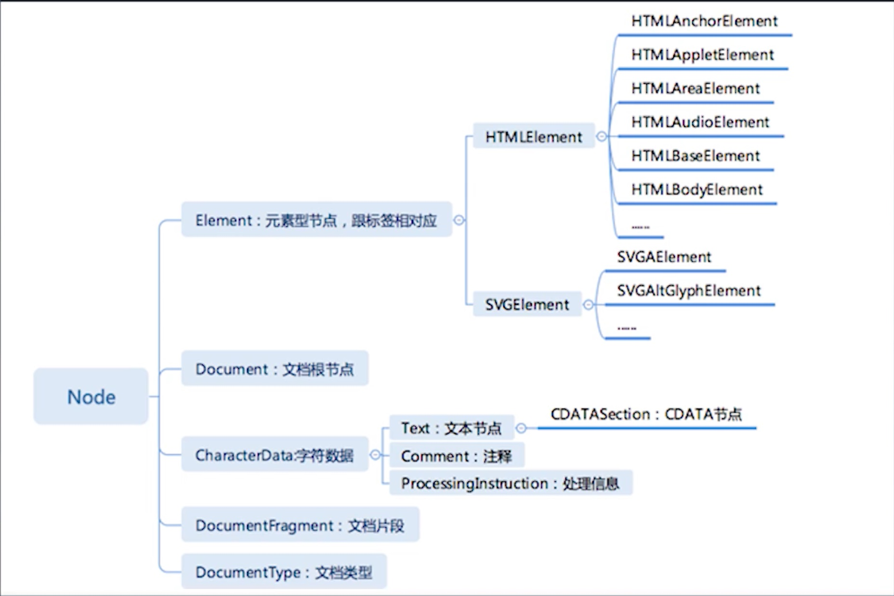

# 学习笔记

## HTML的定义： XML与SGML
HTML主要源流来自于 XML于SGML

### DTD与XML namespace
DTD是SGML规定的定义它子集的一种文档格式，HTML最早设计出来是一个SGML的子集所以也有DTD
&quot--双引号
&amp--&符
&lt--小于号
&gt--大于号

namespace：每个URL都代表唯一的一种语言
* HTML
* XHTML
* MathML
* SVG

### HTML标签语义


## 浏览器API
DOM, BOM：浏览器对象模型。
### DOM API

#### 节点部分，
导航类操作
* parentNode
* childNodes
* firstChild
* lastChild
* nextSibling
* previousSibling
* parentElement
* children
* firstElementChild
* lastElementChild
* nextElementSibling
* previousElementSibling
修改操作
* appendChild
* insertBefore
* removeChild
* replaceChild
高级操作
* compareDocumentPosition 是一个用于比较两个节点中关系的函数
* contains 检查一个节点是否包含另一个节点的函数
* isEqualNode 检查两个节点时候完全相同
* isSameNode 检查两个节点是否是同一个节点，实际上在JavaScript中可以用‘===’
* cloneNode 复制一个节点，如果传入参数true，则会连同子元素做深拷贝
#### 事件部分
addEventListener(type[事件类型]， listener， options);
##### 冒泡与捕获
任何一次事件触发中两个过程都会发生。任何一个事件都是先捕获，从外到内一层一层的去计算事件发生在哪个元素上。
冒泡是我们已经算出来点到那个元素，层层的向外去触发，然后让这个元素去响应这个事件的过程。

#### range API: 跟精确的操作DOM树
```
<body>
    <div id="a">
        <span>1</span>
        <p>2</p>
        <p>3</p>
        <div>4</div>
    </div>
</body>
<script>
    let element = document.getElementById('a');

    function reversechildren(element){
        let children = Array.prototype.slice.call(element.childNodes);

        for (let child of children) {
            element.removeChild(child);
        }

        children.reverse();

        for(let child of children){
            element.appendChild(child);
        }
    }

    reversechildren(element);

</script>
```

```
<body>
    <div id="a">
        <span>1</span>
        <p>2</p>
        <p>3</p>
        <div>4</div>
    </div>
</body>
<script>
    let element = document.getElementById('a');

    function reversechildren(element){
        var l = element.childNodes.length;
        while(l-- > 0){
            element.appendChild(element.childNodes[l])
        }
    }

    reversechildren(element);

</script>
```

```
var range = new Range()
range.setStart(element, 9)
range.setEnd(element, 4)
var range = document.getSelection().getRangeAt(0)
```

创建range节点，便捷的选中方式
* range.setStartBefore
* range.setEndBefore
* range.setStartAfter
* range.setEndAfter
* range.selectNode
* range.selectNodeContents

* var fragment = range.extractContents()； //取出range里的内容
* range.insertNode(document.createTextNode('aaa'))； //在range位置插入新节点
extractContents出来的是fragment对象

```

```

```
<body>
    <div id="a">
        <span>1</span>
        <p>2</p>
        <p>3</p>
        <div>4</div>
    </div>
</body>
<script>
    let element = document.getElementById('a');

    function reversechildren(element){
        let range = new Range();
        range.selectNodeContents(element);

        let fragment = range.extractContents();
        var l = fragment.childNodes.length;
        while(l-- > 0){
            fragment.appendChild(fragment.childNodes[l])
        }

        element.appendChild(fragment);
    }

    reversechildren(element);
</script>
```

### CSSOM
document.styleSheets
#### rules
一个styleSheets对应一个style标签或一个link标签
* document.styleSheets[0].cssRules
* document.styleSheets[0].insertRule("p{color:pink;}", 0);   //（传入的代码，插入的位置）
* document.styleSheets[0].removeRule(0)

* CSSStyleRule
    * selectorText String
    * style K-V结构
* CSSCharsetRule
* CSSImportRule
* CSSMediaRule
* CSSFontFaceRule
* CSSPageRule
* CSSNamespaceRule
* CSSKeyframesRule
* CSSKeyframeRule
* CSSSupportsRule

#### getComputedStyle   取到页面上元素真实渲染所需要的CSS属性，同时也能访问到伪元素上
* window.getComputedStyle(elt, pseudoElt);
    * elt 想要获取的元素
    * pseudoElt 可选，伪元素

### CSSOM View  获取layout或者render之后得到的信息，跟浏览器最后画上去的视图相关

#### window 浏览器窗口
* window.innerHeight, window.innerWidth //实际上使用的viewport
* window.outerWidth, window.outerHeight //包含浏览器自带工具栏的宽高 
* window.devicePixelRatio   //屏幕上的物理像素跟代码里逻辑像素PX的比值
* window.screen
    * window.screen.width
    * window.screen.height
    * window.screen.availWidth  //可以使用的宽和高
    * window.screen.availHeight

* window.open("about:blank", "_blank", "width=100,height=100,left=100,right=100")
* moveTo(x, y)
* moveBy(x, y)
* resizeTo(x, y)
* resizeBy(x, y)

#### scroll
* scrollTop
* scrollLeft
* scrollWidth
* scrollHeight
* scroll(x, y)  //滚动到特定位置
* scrollBy(x, y)    //当前基础上滚动一个差值
* scrollIntoView()  //强制滚动屏幕的可见区域

#### layout
* getClientRects()  //每个元素上都可以调用来获取生成的所有的盒
* getBoundingClientRect()   //  取一个包裹元素所有内容的盒，取元素最外层的盒

* window
    * scrollX
    * scrollY
    * scroll(x, y)
    * scrollBy(x, y)


## 其他API
来自于四个标准化组织
* khronos
    * webGL
* ECMA
    * ECMAScript
* WHATWG
    * HTML
* W3C
    * webaudio
    * CG/WG